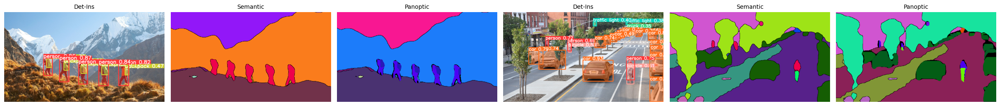

<div align="center">
    <h1>Panoptic Segmentation using YOLOv9 <br/> for Image Captioning </h1>
</div>

[](https://www.python.org)
[](https://pytorch.org)


  
```
📝 A group of 5 people with backpacks and 5backpacks in the snow.
📝 2bicycles and 18cars on a road.
```

---

## 🏗️ Methodology

- 🎨🖌️ Panoptic Segmentation Model: **gelan-c-pan.pt**
- 🎨🖌️ App: **coco.yaml**
- 🎨🖌️ Framework: **PyTorch + WongKinYiu/yolov9**
- 🔡🔤 Image Captioning Model: **mrm8488/t5-base-finetuned-common_gen**
- 🔡🔤 App: **keytotext**
- 🔡🔤 Framework: **Hugging Face**

---

## ⭐ Acknowledgements

- keytotext powered by `Hugging Face`
- WongKinYiu/yolov9

---
